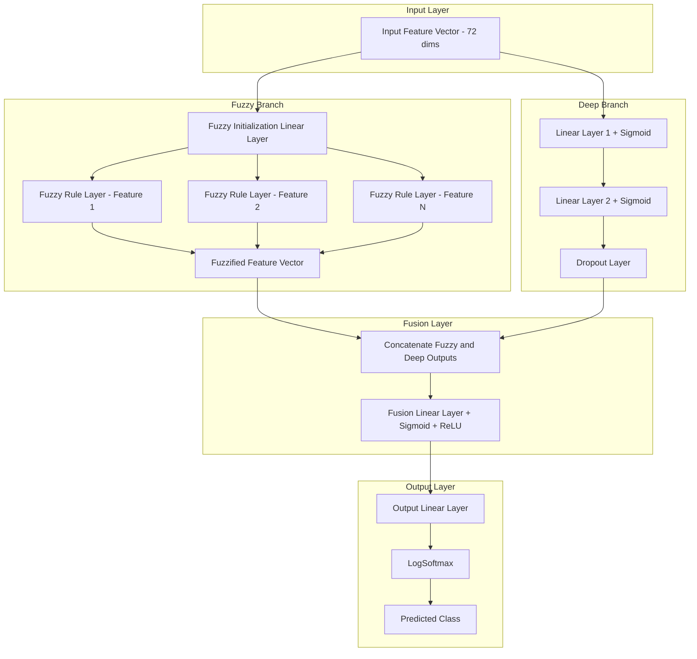
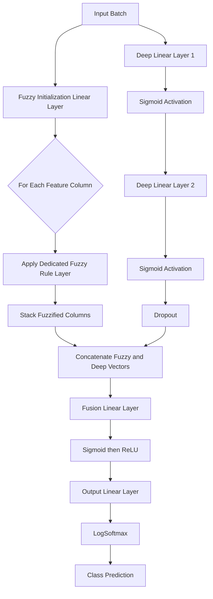

<div align="center">

</div>

---

# Hierarchical Fuzzy Deep Neural Network for Multiclass Data Classification

> A PyTorch implementation of a hybrid neuro-fuzzy architecture that fuses per-feature fuzzy rule inference with a deep neural pathway, reproducing the Hierarchical Fused Fuzzy Deep Neural Network (HFDNN) design for multiclass classification.

<div align="left">

[](https://www.python.org/)
[](https://pytorch.org/)
[](https://numpy.org/)
[](https://scipy.org/)
[](https://scikit-learn.org/)
[](#)
[](#)
[](https://ieeexplore.ieee.org/document/7482843)
[](https://opensource.org/licenses/MIT)

</div>

## Abstract

Purely data-driven deep networks and purely rule-based fuzzy systems each address multiclass classification with complementary strengths: deep networks excel at learning hierarchical feature representations, while fuzzy inference systems provide interpretable, uncertainty-aware reasoning over individual features. This project implements a **Hierarchical Fused Fuzzy Deep Neural Network (HFDNN)**, following the architecture proposed in the reference IEEE paper, which learns a bank of per-feature Gaussian fuzzy rule layers in parallel with a standard feed-forward deep pathway, then fuses both representations before the final classification head. The model is trained and evaluated on a 6-class dataset with 72-dimensional input vectors, and two architectural configurations are compared to study the effect of the fuzzy rule bank size on classification performance.

## Table of Contents

1. [Overview](#overview)
2. [System Architecture](#system-architecture)
3. [Model Workflow](#model-workflow)
4. [Methodology](#methodology)
   - 4.1 [Fuzzy Rule Layer](#41-fuzzy-rule-layer)
   - 4.2 [Deep Feature Pathway](#42-deep-feature-pathway)
   - 4.3 [Fusion and Classification Head](#43-fusion-and-classification-head)
5. [Experimental Setup](#experimental-setup)
6. [Results and Analysis](#results-and-analysis)
7. [Project Structure](#project-structure)
8. [Usage and Installation](#usage-and-installation)
9. [Author](#author)

# Overview

The HFDNN treats every input feature as a candidate for fuzzy reasoning: each feature is passed through its own dedicated fuzzy rule layer, whose Gaussian-shaped membership function is learned jointly with the rest of the network. In parallel, the raw feature vector is also processed by a conventional two-layer sigmoid pathway that captures non-linear feature interactions. The two representations are concatenated and fused through a dedicated linear layer before the final classification decision is made.

This project covers the full experimental cycle:

- Loading and preparing the 72-dimensional, 6-class dataset from `.mat` source files
- Stratifying the data into training, validation, and test splits
- Implementing the per-feature Gaussian fuzzy rule layer from scratch as a PyTorch module
- Implementing the deep sigmoid pathway and the fusion/classification head
- Training two architectural configurations with different fuzzy rule bank sizes
- Comparing validation/training convergence and final test accuracy across configurations

---

# System Architecture

The network follows a two-branch fusion architecture in which a fuzzy reasoning branch and a deep feature-learning branch operate on the same input in parallel, and their outputs are combined before classification.



### Architectural Components

| Layer | Responsibility |
|:---------|:---------------|
| Fuzzy Branch | Per-feature Gaussian fuzzy rule inference with learnable center and spread parameters |
| Deep Branch | Non-linear feature transformation through stacked sigmoid layers with dropout regularization |
| Fusion Layer | Concatenation and joint transformation of fuzzy and deep representations |
| Output Layer | Linear projection to class logits followed by log-softmax normalization |

This design allows the network to combine the interpretable, uncertainty-aware behavior of fuzzy inference with the representational capacity of a deep neural pathway, rather than relying on either mechanism alone.

# Model Workflow



---

# Methodology

## 4.1 Fuzzy Rule Layer

Each input feature is routed through its own `FuzzyLayer` module, which learns a Gaussian-shaped membership function parameterized by a fuzzy degree (center) and a sigma (spread), both initialized with Xavier and unit initialization respectively:

```python
class FuzzyLayer(nn.Module):
    def __init__(self, input_dim, output_dim):
        super(FuzzyLayer, self).__init__()
        self.fuzzy_degree = nn.Parameter(torch.Tensor(input_dim, output_dim))
        self.sigma = nn.Parameter(torch.Tensor(input_dim, output_dim))
        nn.init.xavier_uniform_(self.fuzzy_degree)
        nn.init.ones_(self.sigma)

    def forward(self, input_data):
        fuzzy_out_i = torch.exp(-torch.sum(torch.sqrt((variable - self.fuzzy_degree) / (self.sigma ** 2))))
        return fuzzy_out_i
```

A separate fuzzy rule layer instance is created for every column of the fuzzy-projected input, so the size of the fuzzy rule bank directly controls how finely the model reasons over the feature space.

## 4.2 Deep Feature Pathway

In parallel with the fuzzy branch, the raw input vector is transformed through two fully-connected layers with sigmoid activations and a dropout layer, allowing the network to learn non-linear feature interactions independently of the fuzzy reasoning path:

```python
dl_layer_1_output = torch.sigmoid(self.dl_linear_1(input_data))
dl_layer_2_output = torch.sigmoid(self.dl_linear_2(dl_layer_1_output))
dl_layer_2_output = self.dropout_layer(dl_layer_2_output)
```

## 4.3 Fusion and Classification Head

The fuzzified feature vector and the deep pathway output are concatenated and passed through a fusion linear layer with a sigmoid-then-ReLU activation, followed by the final linear output layer and a log-softmax normalization to produce class probabilities:

```python
cat_fuzz_dl_output = torch.cat([fuzz_output, dl_layer_2_output], dim=1)
fused_output = torch.relu(torch.sigmoid(self.fusion_layer(cat_fuzz_dl_output)))
output_data = self.log_softmax(self.output_layer(fused_output))
```

---

# Experimental Setup

| Component | Configuration |
|:--------------------|:--------------------------------------------|
| Dataset | 720 samples, 72-dimensional feature vectors, 6 target classes |
| Data Split | 70% training / 10% validation / 20% test (random split) |
| Input Source | `.mat` files loaded via `scipy.io.loadmat` |
| Loss Function | Cross-Entropy Loss |
| Optimizer | Stochastic Gradient Descent (SGD) |
| Batch Size | 8 |
| Epochs | 20 |
| Compute Device | CUDA GPU when available, CPU otherwise |
| Compared Configurations | Fuzzy rule bank size of 100 vs. 90 |

---

# Results and Analysis

### Configuration Comparison

| Configuration | Fuzzy Rule Neurons | Learning Rate | Test Loss | Test Accuracy |
|:----------------|:--------------------|:----------------|:------------|:----------------|
| Configuration A | 100 | 0.01 | 219.4649 | **51.03%** |
| Configuration B | 90 | 0.01 | 8.3716 | 36.55% |

### Observations

- Both configurations show a consistent, monotonic decrease in training and validation loss across all 20 epochs, indicating stable convergence of the hybrid fuzzy-deep architecture.
- Increasing the fuzzy rule bank size from 90 to 100 neurons improves final test accuracy from 36.55% to 51.03%, suggesting that a finer-grained per-feature fuzzy partitioning helps the model capture more discriminative patterns for this classification task.
- The fusion of fuzzy rule inference with the deep sigmoid pathway allows the network to benefit from feature-level uncertainty modeling in addition to standard non-linear feature learning, consistent with the design goals described in the reference paper, *A Hierarchical Fused Fuzzy Deep Neural Network for Data Classification* ([IEEE Xplore](https://ieeexplore.ieee.org/document/7482843)).

---

# Project Structure

```text
Hierarchical-Fuzzy-Deep-Neural-Network-for-Multiclass-Data-Classification
│
├── HFDNN_Fuzzy_Deep_Neural_Network_Classification.ipynb
│
├── data/
│   ├── input_a2.mat
│   └── label.mat
│
└── README.md
```

---

# Usage and Installation

```bash
# 1. Clone the repository
git clone https://github.com/farzadjannati/Hierarchical-Fuzzy-Deep-Neural-Network-for-Multiclass-Data-Classification.git
cd Hierarchical-Fuzzy-Deep-Neural-Network-for-Multiclass-Data-Classification

# 2. Create and activate the environment
conda create -n hfdnn python=3.10
conda activate hfdnn

# 3. Install dependencies
# Core deps: torch, torchvision, numpy, scipy, scikit-learn
```

### Reproducibility

To reproduce the results, run the notebook cells sequentially. Update the `.mat` file paths to point to the local `data/` directory, then execute both configuration cells to compare fuzzy rule bank sizes.

---

# License

This project is licensed under the MIT License.

## Author

**Parmida Ghamari**
M.Sc. Student, University of Tehran
Research Assistant @ Social Networks Lab

**Research Interests:** Neuro-Fuzzy Systems, Fuzzy Logic and Approximate Reasoning, Hybrid Deep Learning Architectures, Pattern Classification, Soft Computing

📧 [Parmida.ghamari@gmail.com](mailto:Parmida.ghamari@gmail.com) | 💻 [github.com/ParmidaGh](https://github.com/ParmidaGh) | 💼 [www.linkedin.com/in/parmida-ghamari](https://www.linkedin.com/in/parmida-ghamari)

---

# Support

If you find this project useful, consider giving it a star ⭐

---

<p align="center">
Built with using PyTorch and NumPy
</p>
